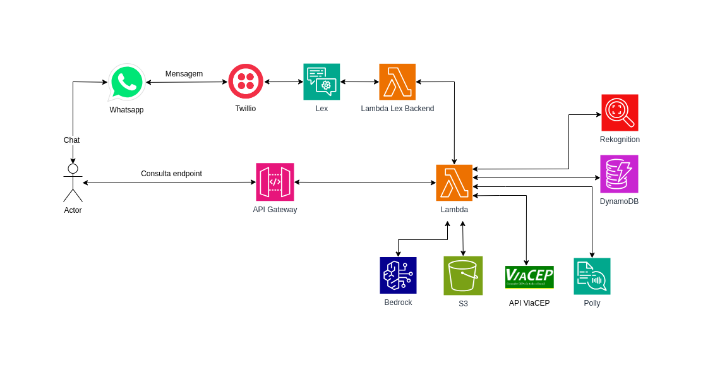
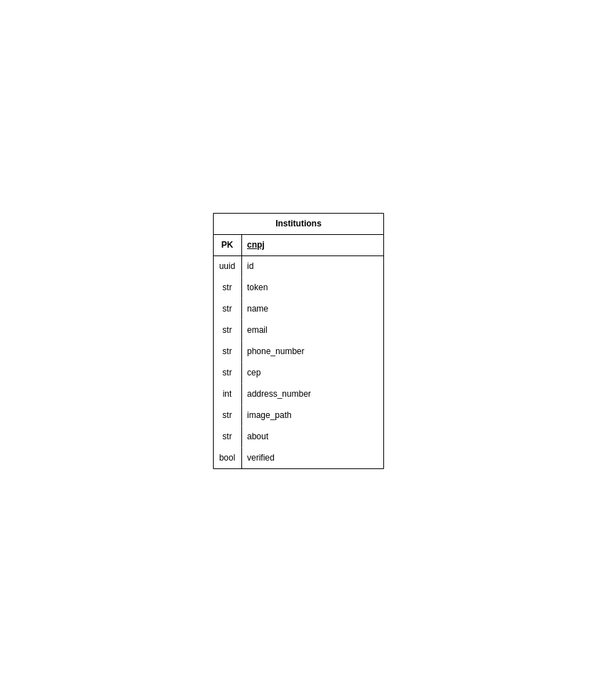

# Conexão Solidária (Refatorado)

---

<p align="center">
  
  
  
  
  
  
  
  
  
  
  
  
  
</p>

---

## **📜 Descrição**

> **Nota da Mantenedora:** Este projeto nasceu originalmente como conclusão do bootcamp AWS da Compass UOL. Atualmente, ele foi refatorado e é evoluído de forma solo por [Monique da Silva Borges](https://github.com/niqueborges). Os créditos à equipe original estão no final deste documento.

Este projeto **Conexão Solidária** tem como objetivo criar uma plataforma de comunicação entre doadores e instituições, com suporte a um chatbot multicanal e integração com AWS. A plataforma utiliza Django para o backend e frontend, Docker e EC2 para a execução do chatbot, e diversas soluções AWS para melhorar a experiência do usuário.

---

## **📑 Índice**

- [✨ Funcionalidades, Arquitetura e Fluxo de Trabalho](#funcionalidades)
- [📦 Como Rodar a Aplicação](#como-rodar)
- [💻 Tecnologias Utilizadas](#tecnologias)
- [🗄️ Banco de Dados](#banco-de-dados)
- [📂 Estrutura de Diretórios](#estrutura)
- [📅 Metodologia de Desenvolvimento](#metodologia)
- [😿 Principais Dificuldades](#dificuldades)
- [🧪 Como Testar](#testar)
- [🤝 Como Contribuir](#contribuir)
- [📜 Termos de Uso](#termos)

---

<a id="funcionalidades"></a>

## **✨ Funcionalidades, Arquitetura e Fluxo de trabalho ⚙️**

---

O repositório é estruturado em três áreas principais:

- **Backend (Chatbot)**: Implementação da lógica do chatbot, com integrações ao **Amazon Lex**, **Twilio** e outros serviços AWS.
- **Backend (Infraestrutura AWS)**: Configurações do **Serverless Framework** para gerenciar recursos da AWS, como **S3**, **Polly** e **Rekognition**.
- **Frontend (Website)**: Aplicação Django que oferece a interface para os usuários, permitindo a busca por instituições e integração com o backend. A aplicação é containerizada com **Docker** para garantir consistência no ambiente e implantada em **Amazon EC2** para alta disponibilidade e escalabilidade.

---

O projeto adota uma arquitetura serverless na AWS, complementada por contêineres e instâncias escaláveis para flexibilidade e desempenho. Os principais componentes incluem:

1. **Chatbot Multicanal**: Integração com **Amazon Lex** e **Twilio** para interação via WhatsApp.
2. **Armazenamento**: Persistência de dados no **DynamoDB**, com processamento via **AWS Lambda**.
3. **Moderação Inteligente**: Uso de **Amazon Rekognition** e **Bedrock** para moderação de imagens e textos.
4. **Acessibilidade**: Conversão de texto para fala com **Amazon Polly**.
5. **Geolocalização**: Consultas de endereços feitas pela **API ViaCEP**.
6. **Escalabilidade e Containerização**: A aplicação web é executada em **Docker** para ambientes consistentes e escalada na **Amazon EC2** para maior capacidade conforme necessário.
7. **Diagrama da Arquitetura**



---

<a id="como-rodar"></a>

## **📦 Como Rodar a Aplicação**

A ordem de deploy deste projeto é estritamente sequencial, pois o Frontend e o Chatbot dependem das URLs geradas pela API Serverless.

### **1. Requisitos e Clonagem**

Certifique-se de ter os seguintes pré-requisitos instalados:

- [Python 3.9+](https://www.python.org/downloads/)
- [Docker](https://www.docker.com/products/docker-desktop) (para rodar a aplicação web isoladamente)
- [AWS CLI](https://aws.amazon.com/cli/)
- [Serverless Framework](https://www.serverless.com/framework/docs/getting-started/) (`npm install -g serverless`)
- [Node.js](https://nodejs.org/en/download/)

Clone o repositório em sua máquina:

```bash
git clone https://github.com/niqueborges/conexao-solidaria.git
cd conexao-solidaria
```

Configure o AWS CLI com suas credenciais para que o Serverless Framework possa provisionar os recursos:

```bash
aws configure
```

---

### **2. Configuração de Parâmetros e Segredos (AWS SSM & Secrets Manager)**

Antes de realizar os deploys, a arquitetura requer a configuração de parâmetros seguros na sua conta AWS:

1. **E-mail de Alertas Financeiros (AWS SSM):**
   Crie um parâmetro no *Parameter Store* para receber os alarmes de custos do projeto.

   ```bash
   aws ssm put-parameter --name "/conexao-solidaria/budget/email" --value "seu-email@exemplo.com" --type String
   ```
2. **Credenciais do Twilio (AWS Secrets Manager):**
   O chatbot faz o *fetch* das chaves do Twilio dinamicamente para não as expor no código. Crie o segredo:

   ```bash
   aws secretsmanager create-secret \
       --name "conexao-solidaria/twilio" \
       --secret-string '{"ACCOUNT_SID":"seu_sid","AUTH_TOKEN":"seu_token"}'
   ```

---

### **3. Deploy da Infraestrutura e API (Serverless)**

Este passo cria o DynamoDB, S3, Lambdas da API, WAF Global e a distribuição CloudFront.

```bash
cd serverless
npm install
serverless deploy
```

**Importante:** Ao final do processo, o terminal exibirá os **endpoints e outputs**. O sistema possui um bloqueio (*Anti-Bypass*) contra acessos diretos à API Gateway. Portanto, **NÃO** use o endpoint cru. Copie o valor de **`CloudFrontDomainName`** (ex: `d123456.cloudfront.net`), pois ele será a URL base `https://d123456.cloudfront.net` nos próximos passos.

---

### **4. Deploy do Chatbot e Integração Twilio**

O Chatbot requer suas próprias dependências Python. É fundamental isolá-las usando um ambiente virtual (venv).

1. Entre na pasta do chatbot, crie o ambiente virtual e ative-o:

```bash
cd chatbot/backend
python -m venv venv
# No Windows:
.\venv\Scripts\activate
# No Linux/Mac:
source venv/bin/activate
```

2. Instale as dependências:

```bash
pip install -r requirements.txt
```

3. Realize o deploy:

```bash
serverless deploy
```

**Configuração do Twilio:** O comando acima gerará um endpoint específico para o webhook (ex: `/twilio`). Para que o bot funcione no WhatsApp, você **deve** ir ao painel do Twilio, na configuração do seu número de WhatsApp, e colar a URL gerada pelo Serverless no campo de webhook de mensagens recebidas.

### **5. Rodando o Frontend (Website)**

O Frontend atua como um BFF e precisa saber onde estão as APIs recém-deployadas.

1. Navegue até a pasta `website`:

```bash
cd website
```

2. Crie um arquivo `.env` na raiz do `website` contendo as URLs geradas nos passos 2 e 3. Exemplo:

```env
GET_INSTITUTIONS="https://<URL_API>/api/v1/institutions"
GET_INSTITUTION="https://<URL_API>/api/v1/institutions/{cnpj}"
GET_INSTITUTIONS_BY_STATE="https://<URL_API>/api/v1/institutions/query?state={state}"
GET_INSTITUTIONS_BY_REGION="https://<URL_API>/api/v1/institutions/query?region={region}"
CHATBOT_API_URL="https://<URL_CHATBOT>"
```

3. Crie um ambiente virtual e instale as dependências (para execução local):

```bash
python -m venv venv
# Ative o venv (Windows): .\venv\Scripts\activate
# Ative o venv (Linux/Mac): source venv/bin/activate
pip install -r requirements.txt
```

4. Execute o servidor localmente:

```bash
python manage.py runserver
```

Acesse: [http://127.0.0.1:8000](http://127.0.0.1:8000)

---

### **6. Execução com Docker e EC2 (Produção)**

Caso não queira rodar localmente com o `runserver`, você pode rodar o Frontend via contêiner. O `.env` criado no passo anterior será absorvido pelo Docker.

```bash
docker build -t conexao-solidaria .
docker run -d -p 8000:8000 conexao-solidaria
```

Para produção no EC2:

1. Suba uma instância EC2 (Ubuntu/Amazon Linux 2)
2. Instale o Docker e faça upload da sua imagem.
3. Garanta que o Security Group permita tráfego na porta desejada (ex: 8000 ou 80) e execute o contêiner.

---

## **Verificação Final**

- **Frontend:** Abra a aba "Instituições" e garanta que os cards foram carregados do DynamoDB pela API Serverless.
- **Chatbot:** Envie uma mensagem ("Oi") para o número de WhatsApp configurado no Twilio e garanta que o Amazon Lex respondeu corretamente.

---

<a id="tecnologias"></a>

## **💻 Tecnologias Utilizadas**

- **Amazon Bedrock**
- **Amazon DynamoDB**
- **Amazon Lex**
- **Amazon Polly**
- **Amazon Rekognition**
- **Amazon S3**
- **Amazon EC2**
- **API ViaCEP**
- **AWS Lambda**
- **Django**
- **Docker**
- **Python**
- **Twilio**

---

<a id="banco-de-dados"></a>

## **🗄️ Banco de Dados**

A estrutura de armazenamento das Instituições é baseada no **Amazon DynamoDB**, garantindo alta disponibilidade e escalabilidade.



---

<a id="estrutura"></a>

## **📂 Estrutura de Diretórios**

Este repositório contém o código-fonte do projeto **Conexão Solidária**, com a divisão entre backend, integração com AWS, e o frontend da aplicação. Abaixo está a estrutura principal do repositório:

```plaintext
conexao-solidaria/
├── .github/
│   └── workflows/
│       └── ci.yml                       # Pipeline de CI/CD (GitHub Actions)
├── assets/
│   └── img/                             # Imagens referentes a diagramas de arquitetura e BD
├── chatbot/                             # Serviço principal do Chatbot
│   ├── backend/                         # Core do backend (Domain-Driven Design)
│   │   ├── domain/                      # Adaptadores, interfaces e regras de negócio
│   │   ├── handlers/                    # Funções Lambda (Lex, Twilio, Health)
│   │   ├── infrastructure/              # Integrações externas (AWS, APIs)
│   │   ├── intents/                     # Manipuladores de intenções do Lex
│   │   ├── tests/                       # Testes automatizados
│   │   └── utils/                       # Funções utilitárias diversas
│   └── bot/                             # Interfaces ou simuladores do Bot
│       ├── v1/
│       └── v2/
├── docs/                                # Documentações adicionais e de arquitetura
├── serverless/                          # Configurações do Serverless Framework e Backend da API
│   ├── api/                             # Controladores e rotas (handlers API Gateway)
│   ├── core/                            # Lógica central, segurança e configurações
│   ├── domain/                          # Regras de negócio e serviços
│   ├── infra/                           # Integração AWS, modelos (DynamoDB) e validações
│   ├── scripts/                         # Automações e utilitários
│   ├── tests/                           # Testes de carga e performance
│   └── utils/                           # Funções utilitárias globais
├── website/                             # Aplicação Frontend em Django
│   ├── app/                             # Configurações centrais do Django
│   ├── bot/                             # Funcionalidades extras atreladas ao Chatbot
│   ├── institutions/                    # App principal para gerenciamento de instituições
│   ├── static/                          # Arquivos CSS, JS e imagens
│   ├── tests/                           # Testes de software do frontend
│   └── utils/                           # Funções utilitárias do Django
├── .editorconfig                        # Configurações de padronização de editor
├── .gitignore                           # Arquivo para ignorar artefatos desnecessários
├── .pre-commit-config.yaml              # Configuração de hooks de pré-commit
├── ARCHITECTURE_EVOLUTION.md            # Histórico de evolução da arquitetura
├── CONTRIBUTING.md                      # Guia de contribuição do projeto
├── package-lock.json                    # Controle estrito de versões do NPM
├── package.json                         # Dependências e scripts do Node.js
├── postman_collection.json              # Coleção de rotas para teste da API
└── README.md                            # Documentação principal do projeto
```

---

<a id="metodologia"></a>

## **📅 Metodologia de Desenvolvimento**

Adotamos a metodologia **Ágil**, com **Sprints** curtas, **Daily Meetings** e **Code Reviews** para garantir a qualidade e agilidade no desenvolvimento.

---

<a id="dificuldades"></a>

## **😿 Principais Dificuldades**

1. **Integração de múltiplos serviços AWS**: A configuração de vários serviços como **Lex**, **Rekognition** e **Polly** envolveu um desafio técnico considerável.
2. **Moderação de conteúdo**: Encontrar a melhor combinação de serviços para moderação eficiente de imagens e textos foi complexo.
3. **Gerenciamento de estado do chatbot**: Manter a continuidade das conversas no **Amazon Lex** foi um desafio técnico.

---

<a id="testar"></a>

## **🧪 Como Testar**

Para garantir a confiabilidade da aplicação, o projeto conta com testes unitários e de carga.

- **Testes da API e Frontend**: Execute os testes do Django navegando até a pasta `website` e rodando `python manage.py test`.
- **Testes de Carga e WAF**: Existe um script de teste de carga feito em K6 na pasta `serverless/tests/k6_load_test.js` para validar a segurança e resiliência da infraestrutura Serverless sob demanda.

---

<a id="contribuir"></a>

## **🤝 Como Contribuir**

Ficamos felizes com contribuições! Se você deseja reportar um problema, sugerir melhorias ou enviar *Pull Requests*, leia nosso [Guia de Contribuição](CONTRIBUTING.md) completo para entender os padrões de commit, arquitetura e fluxo de desenvolvimento.

---

<a id="termos"></a>

## **📜 Termos de Uso**

Os **Termos de Uso** podem ser acessados em [termos de uso](https://conexao-solidaria-termos.s3.amazonaws.com/termos.html).

---

## **👥 Equipe Original (Bootcamp)**

O projeto base foi construído de forma colaborativa durante o bootcamp da Compass UOL pelos seguintes desenvolvedores:

| [](https://github.com/gusttavofelipe) [Gusttavo Felipe](https://github.com/gusttavofelipe) | [](https://github.com/niqueborges) [Monique da Silva Borges](https://github.com/niqueborges) | [](https://github.com/PedroNunesBH) [Pedro Nunes](https://github.com/PedroNunesBH) | [](https://github.com/Rogerdev02) [Roger Dev](https://github.com/Rogerdev02) | [](https://github.com/SilvioCMJ) [Silvio CMJ](https://github.com/SilvioCMJ) |
| :--------------------------------------------------------------------------------------: | :----------------------------------------------------------------------------------------: | :------------------------------------------------------------------------------: | :------------------------------------------------------------------------: | :-----------------------------------------------------------------------: |

---

Este projeto continuou sendo evoluído de forma solo seguindo padrões avançados de arquitetura serverless.
