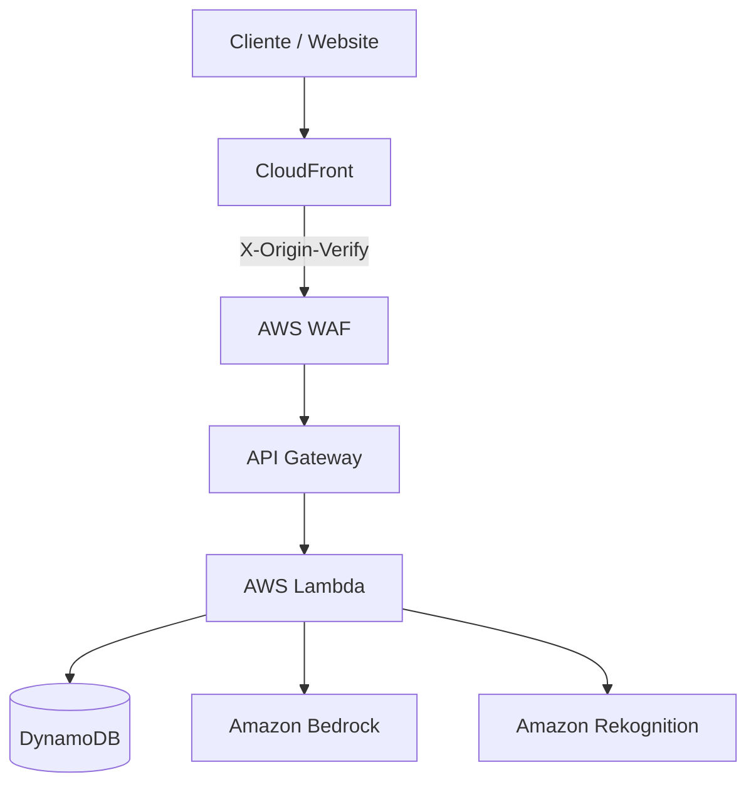
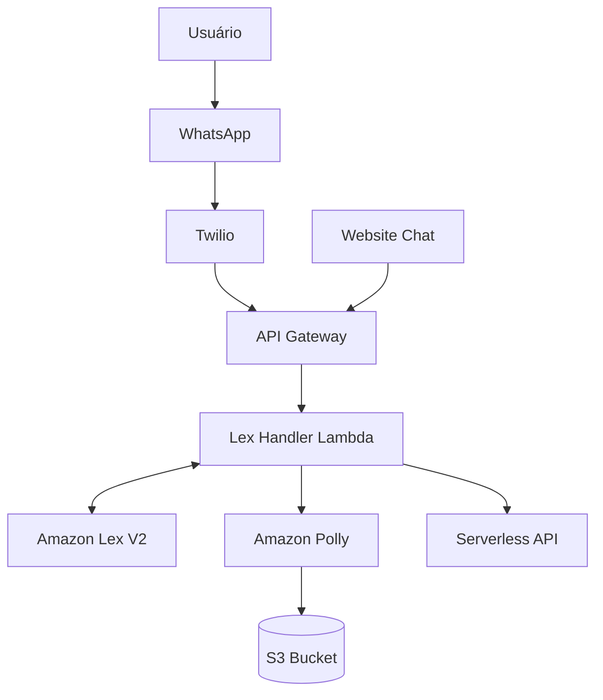

# Arquitetura do Sistema

## API Serverless (CRUD de Instituições)

A API principal expõe operações CRUD protegidas por AWS WAF e CloudFront, utilizando o DynamoDB para persistência de dados.

## Chatbot (Lex + Twilio)

O Chatbot recebe requisições do Twilio ou do Proxy Web, e integra com o Amazon Lex para PLN. Em caso de cadastros com áudios, há conversão de texto em voz via Polly e armazenamento no S3.

